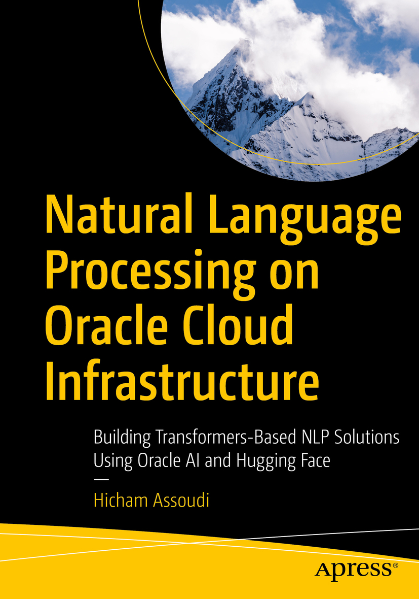

<p align="center">
  
</p>

# Natural Language Processing on Oracle Cloud Infrastructure

This repository contains the full source code that accompanies the book *[Natural Language Processing on Oracle Cloud Infrastructure: Building Transformer-Based NLP Solutions Using Oracle AI and Hugging Face](https://a.co/d/1GJWZNj)*, published by Apress in 2025.

It provides a practical, end-to-end implementation of a real-world healthcare NLP use case—using transformers from Hugging Face and cloud-native services from Oracle Cloud Infrastructure (OCI). The content is designed to be accessible to practitioners, researchers, and students alike.

## About This Repository

The project follows a step-by-step methodology, aligned with the structure of the book. It guides you through:

- Dataset preparation and labeling
- Transformer model selection and fine-tuning
- Model evaluation and deployment
- MLOps and responsible AI practices on OCI

The accompanying code is organized to reflect this progression and is built entirely using Jupyter Notebooks and OCI-native tools.

## Repository Structure

Each subfolder maps to a chapter of the book’s implementation section (Chapters 4 to 8):

| Folder     | Description                                                                 |
|------------|-----------------------------------------------------------------------------|
| `chapt-4`  | OCI tenancy setup, resource provisioning, and workspace configuration       |
| `chapt-5`  | Data wrangling, labeling via OCI Data Labeling, and dataset export to HF    |
| `chapt-6`  | Model selection and fine-tuning (e.g., CamemBERT), performance diagnostics   |
| `chapt-7`  | Model deployment using OCI Data Science Model Deployment                    |
| `chapt-8`  | MLOps using OCI Pipelines, cost considerations, and responsible AI insights |

## Technologies Used

- **Oracle Cloud Infrastructure (OCI)**: Data Science, Object Storage, Data Labeling, Pipelines  
- **Hugging Face Transformers**: Pretrained models and training utilities  
- **Python & Jupyter**: Fully interactive development environment  
- **Domain-specific models**: CamemBERT-bio, MAGBERT-NER, and others

## Who Should Use This

This repository is intended for:

- **NLP and Machine Learning Practitioners** looking to apply transfer learning in Oracle cloud-native setting
- **Oracle Cloud Users** interested in practical applications of AI services on OCI
- **NLP Researchers and Students**, particularly in low-resource language contexts (e.g. French, Arabic), and/or for Healthcare domain 

> *Note:* Many Moroccan universities collaborate with Oracle through educational programs. This repository may serve as a useful resource for academic projects or coursework involving OCI and AI.

## How to Get Started

1. Clone the repository:
   ```bash
   git clone https://github.com/john-doe-typica-ai/nlp-on-oci.git
   ```

2. Navigate through the folders starting from `chapt-4`.

3. Modify and extend the notebooks using your own data, domain, or language as needed.

> **Note:** Access to an Oracle Cloud account with appropriate permissions is required to run the complete pipeline.

## Live Demo

The following Hugging Face Space demonstrates the French Healthcare NER model developed as part of the book’s healthcare use case. It reflects the work covered in Chapters 4 to 7.

**Try the demo**: [HealthcareNER-Fr (Hugging Face Space)](https://huggingface.co/spaces/TypicaAI/HealthcareNER-Fr)

This application highlights how transformer-based NER can be fine-tuned and deployed to extract insights from French medical texts, including named entities such as conditions, medications, and treatments.

### Additional Resources

- **Trained Model**: [HealthcareNER-Fr Model](https://huggingface.co/TypicaAI/HealthcareNER-Fr)  
- **Dataset**: [MedicalNER_Fr](https://huggingface.co/datasets/TypicaAI/MedicalNER_Fr)

## Where to Learn More

- **Book**: [Amazon (US)](https://www.amazon.com/dp/1484296074)  
- **Documentation**: [OCI Data Science Docs](https://docs.oracle.com/en-us/iaas/data-science/)

## License

This repository is provided for educational and non-commercial use. If you build upon or reference this work in your research, teaching, or development, please cite the book.

## Author

This repository and the accompanying book were created by **Hicham Assoudi**, AI researcher and Oracle expert, founder of [Typica.ai](https://typica.ai), and author of *Natural Language Processing on Oracle Cloud Infrastructure*.

- **LinkedIn**: [linkedin.com/in/assoudi](https://www.linkedin.com/in/assoudi)  
- **Hugging Face**: [huggingface.co/hassoudi](https://huggingface.co/hassoudi)  
- **Book Page (SpringerLink)**: [https://link.springer.com/book/10.1007/979-8-8688-1073-2](https://link.springer.com/book/10.1007/979-8-8688-1073-2)

## Citation

If you use this work in your research, please cite it as:

```bibtex
@book{assoudi2025nlpoci,
  title     = {Natural Language Processing on Oracle Cloud Infrastructure: Building Transformer-Based NLP Solutions Using Oracle AI and Hugging Face},
  author    = {Hicham Assoudi},
  year      = {2025},
  publisher = {Apress},
  isbn      = {9781484296076},
  url       = {https://link.springer.com/book/10.1007/979-8-8688-1073-2}
}
```
